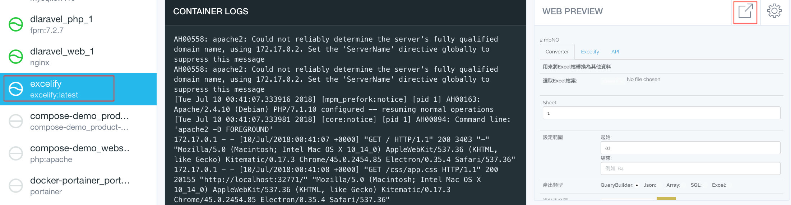
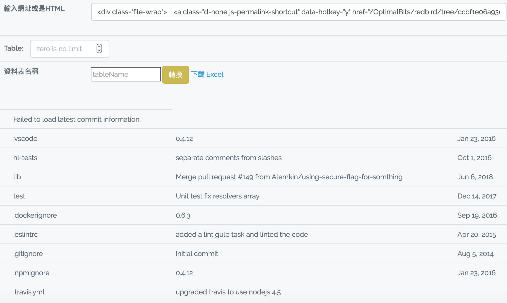
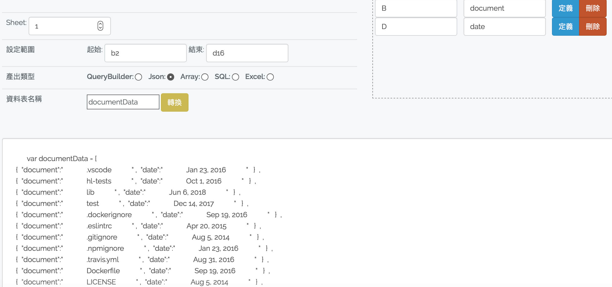
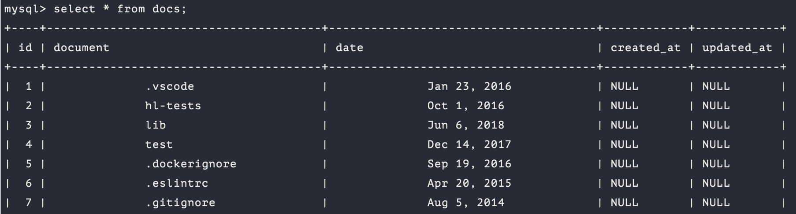
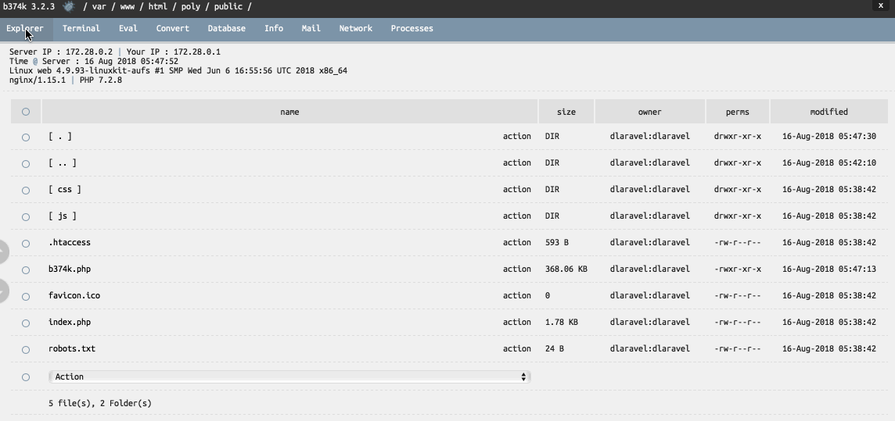

### 1. 简易实例及流程

首先创建项目, 过程中会询问用户密码以便在 /etc/hosts 中指定 sites 文件夹中的域名.
```bash
./create project
cd sites/project
```

以往 Homestead.yaml 映射到 homestead 虚拟机中的项目目录, 现在可以通过  `./console` 获得.
```bash
./console
cd project

php artisan make:model doc -m
```

创建了 model 和数据库之后需要为其添加一些**字段**和数据.

这里引入一个 Excel 转换工具 [excelify](https://github.com/DevinY/excelify) 来提供 **seed** 数据.

在 docker 的 Kitematic 里搜索 excelify ,并在浏览器中打开.



excelify 可以对 HTML 中的 table 标签进行抓取并形成 Excel 文件, 再将 Excel 文件转成 QueryBuilder 或者 JSON 格式.

<br>


以 JSON 和 QueryBuilder 两种方式都可以给数据库传入 seed 数据:


```PHP
 public function run()
{
    $path = base_path().'/database/doc.json';
    $file = File::get($path);
    $data = json_decode($file,true);
    DB::table('docs')->insert($data);
}             
```
```PHP
 public function run()
{ 
    DB::table('docs')->insert([
      [  "document"=>" .vscode " ,  "date"=>" Jan 23, 2016 "   ]  ,  
      [  "document"=>" hl-tests" ,  "date"=>" Oct 1, 2016  "   ]  ,  
      [  "document"=>" lib " ,  "date"=>" Jun 6, 2018 "   ]  ,  
      ......
    ]);
}             
```

在  mysql 中校验一下结果:

```bash
./console mysql 
use project;
select * from docs;
```




### 2. 运行 Polymer 前端项目

创建 host : `shop` , 之后可以 `polymer serve` 或者 http://shop.test 查看项目.
```bash
./create --host shop
mkdir -p sites/shop
cd sites/shop
```

创建 polymer 项目
```bash
polymer init 
polymer build
```

通常我们会通过 ` php -S localhost:7600 -t public ` 来运行 Web 服务器上的 laravel 项目.

同理, 这里将 build 生成的 unbundled 文件夹 软链接到 public 目录下. 

```bash
ln -s build/es6-unbundled public
```

可以通过 ` ./console info ` 找到 http://shop.test , hold 住 command 键点按链接查看最终效果:


### 3. Xdebug 与 PhpStorm 的配置

下载 Xdebug 最新的 source code 到 ext 文件夹, 并设置关联 .

```bash
mkdir ext
cd ext
wget XDEBUG
tar zxvf  XDEBUG

# docker-compose.yml
volumes:
- ./ext:/usr/local/lib/ext
```

 `./console` 进入 `/usr/local/lib/ext` , 依文档编译 Xdebug.

`make install` 之后的资料包默认存放在 `usr/local/lib/php/extensions` 中, 重新保存到 `/usr/local/lib/ext` .

```bash
git pull dlaravel

cp samples/php/php-xdebug.ini etc/php/php.ini   //在 c restart 之后应用这里的配置项

ipconfig getifaddr en0    //查看本机IP

vim  etc/php/php.ini
```

```bash
zend_extension="/usr/local/lib/ext/xdebug.so"
xdebug.ideky=docker
xdebug.remote_host=$GETIFADDR
xdebug.remote_log=/tmp/xdebug.log
```
<br>

`./console restart` .

接下来配置 PhpStorm 的 PHP Servers .

```bash
HOST, PORT:    (从 c info 里获取)
PATH MAPPINGS:   sites/xxx -> /var/www/html/xxx
```

最后在 PhpStorm 的 Edit Configurations 里新增 remote debug .
```bash
Servers: 上一步设置的 server name
ide key: $XDEBUG.IDEKY
```

### 4. b374k

在任意项目 container 的 public 目录下加载 b374k , 然后在同名路由下打开, 并打包. 

```bash
cd b374k
cp b374k.php ..
cd ..
rm -rf b374k
```

现在只要打开 http://demo.test/b374k.php 并输入密码, 即可使用这款 WebShell 工具.




